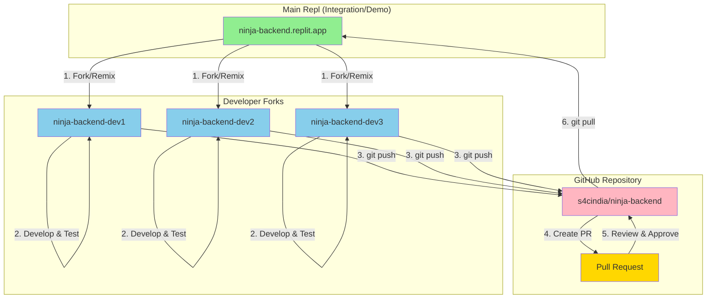

# Ninja Platform: Developer Onboarding & Training Guide

## Complete Developer Reference for S4Carlisle India Team

**Version:** 2.0  
**Date:** December 2025  
**Duration:** 3-hour training session + self-study  
**Prerequisite:** Basic Git knowledge, Node.js familiarity  
**SharePoint Location:** 07 - Knowledge Base

---

## Training Objectives

By the end of this training, you will:

1. Understand the Replit development environment
2. Know when to use Multiplayer vs. Forks
3. Safely interact with the Replit AI Agent
4. Follow the Ninja Git workflow
5. Use provided Replit prompts correctly
6. Debug with Claude Code
7. Manage secrets securely with Bitwarden
8. Create effective Pull Requests
9. Respond to CodeRabbit AI code reviews
10. Understand the CI/CD deployment pipeline
11. Avoid common gotchas that can break the team's work

---

## Module 1: Understanding Replit Architecture (20 min)

### What is Replit?

Replit is a cloud-based development environment where:
- Code runs on remote servers (not your laptop)
- Multiple people can edit simultaneously (Multiplayer)
- Everything is accessible via web browser
- Built-in database, secrets, and deployment

### The Critical Concept: Shared vs. Isolated

**In traditional development:**
```
Your laptop → Your changes → Only you see them
Other's laptop → Their changes → Only they see them
```

**In Replit Multiplayer:**
```
Shared Repl → Your changes → EVERYONE sees them IMMEDIATELY
           → Their changes → YOU see them IMMEDIATELY
           → Server restart → AFFECTS EVERYONE
```

### The "Branch vs. Fork" Distinction

This is the **most important concept** for Ninja development:

| | Git Branch | Replit Fork |
|--|------------|-------------|
| **What it isolates** | Code history | EVERYTHING |
| **Your crash** | Affects everyone | Only affects you |
| **Your bad code** | Breaks everyone's server | Only breaks your server |
| **Your npm install** | Runs for everyone | Only in your fork |

**Golden Rule:**
> A Branch isolates your CODE. A Fork isolates your COMPUTER.

### Exercise 1.1: Understanding Impact

**Scenario:** You add a syntax error while editing `src/index.ts` in the shared Repl.

**What happens in Multiplayer mode?**
- [ ] Only your view shows the error
- [x] Everyone's server crashes
- [ ] Git automatically saves a backup

**What happens in your Fork?**
- [x] Only your fork's server crashes
- [ ] The main Repl is affected
- [ ] Other developers' forks are affected

---

## Module 2: Ninja Development Workflow (30 min)

### Fork Naming Convention

When you create a fork, Replit auto-generates a name like `avrvenkatesa2-12-03`. **You must rename it immediately** to follow the team standard:

| Component | Pattern | Example |
|-----------|---------|---------|
| Backend Fork | `ninja-backend-{firstname}` | `ninja-backend-aravind` |
| Frontend Fork | `ninja-frontend-{firstname}` | `ninja-frontend-priya` |

**How to Rename Your Fork:**
1. Click on the **Repl name in the header bar** (where it shows the auto-generated name)
2. A settings panel opens with a **Name** field
3. Enter the new name: `ninja-backend-{yourfirstname}`
4. Optionally add Description: "Ninja Platform API Server - Node.js + Express + TypeScript"
5. Close the panel - changes save automatically

**Important:** The rename option is NOT in the three-dot menu (⋮). You must click directly on the Repl name in the header.

### The Workflow Diagram (ASCII)

```
┌─────────────────────────────────────────────────────────────┐
│                    NINJA WORKFLOW                           │
├─────────────────────────────────────────────────────────────┤
│                                                             │
│  1. FORK                                                    │
│     Open Project → Click "Start Working"                    │
│     You now have YOUR OWN isolated environment              │
│                                                             │
│  2. DEVELOP                                                 │
│     Make changes in YOUR fork                               │
│     Test in YOUR fork's URL                                 │
│     Commit frequently to Git                                │
│                                                             │
│  3. PUSH                                                    │
│     git push origin feat/your-feature                       │
│     Code goes to GitHub (not to master Repl yet)            │
│                                                             │
│  4. REQUEST REVIEW                                          │
│     Click "Request Review" in Replit Projects               │
│     Or create PR on GitHub                                  │
│                                                             │
│  5. MERGE                                                   │
│     After approval, merge to main                           │
│     Master Repl pulls changes automatically                 │
│                                                             │
└─────────────────────────────────────────────────────────────┘
```

### The Workflow Diagram (Mermaid)



### Step-by-Step: Starting Your Day

```bash
# 1. Open your fork (not the master!)
# Go to: https://replit.com/@s4carlisle/ninja-backend-{yourname}

# 2. Sync with latest main
git fetch origin
git checkout main
git pull origin main

# 3. Create feature branch
git checkout -b feat/NINJA-123-add-pdf-validation

# 4. Start development server
npm run dev

# 5. Make your changes...

# 6. Commit frequently (every 30-60 min or logical checkpoint)
git add .
git commit -m "feat(pdf): add structure validation"

# 7. Push when ready for review
git push origin feat/NINJA-123-add-pdf-validation

# 8. Create PR on GitHub or Request Review in Replit
```

### First-Time Fork Setup

When you first create a fork:

1. **Rename immediately** - Click Repl name in header → Change to `ninja-backend-{firstname}`
2. **Configure secrets** - Copy from Bitwarden (see Module 5)
3. **Set Git identity** - `git config user.email` and `git config user.name`
4. **Verify setup** - Run `npm run dev` and check server starts

### When to Use What

| Situation | Use | Reason |
|-----------|-----|--------|
| New feature development | Your Fork | Isolation |
| Bug fix | Your Fork | Isolation |
| Config change (minor) | Your Fork, then merge | Safety |
| Pair programming | Multiplayer in YOUR Fork | Both isolated from master |
| Live demo | Master Repl | Stable, always working |
| Code review | Multiplayer in author's Fork | See changes together |
| Emergency hotfix | Your Fork → Fast merge | Quick but controlled |

### Exercise 2.1: Workflow Practice

**Task:** Practice the complete workflow

1. Open your fork
2. Create branch: `feat/training-exercise`
3. Add a comment to `src/index.ts`: `// Training: [Your Name]`
4. Commit with message: `docs: add training comment`
5. Push to GitHub
6. Create PR (but don't merge)
7. Delete the PR (cleanup)

---

## Module 3: AI Agent Safety (30 min)

### What is the Replit Agent?

The Agent is an AI that can:
- Write and modify code
- Run terminal commands
- Access the database
- Install packages
- Create and delete files

### The "Junior Developer" Model

Think of the Agent as a talented but inexperienced junior developer:

**Good at:**
- Generating boilerplate
- Writing tests from examples
- Setting up standard patterns

**Bad at:**
- Understanding system-wide impact
- Knowing when NOT to change something
- Respecting architectural boundaries

### Real Risks (Documented Cases)

| What Agent Did | Impact |
|----------------|--------|
| Ran DROP TABLE to "fix" schema mismatch | Lost production data |
| Refactored auth to "improve" it | Broke login for everyone |
| Installed conflicting packages | Server crashed |
| Deleted "unused" files | Removed critical configs |

### AI Agent Safety Protocol

**Rule 1: NEVER use Agent in Master Repl**
```
❌ Open master → Ask Agent to make changes
✅ Open YOUR FORK → Ask Agent to make changes
```

**Rule 2: Remove Database Credentials for Risky Agent Work**
```
# Before using Agent for experimental work:
# 1. Go to Secrets
# 2. Delete or rename DATABASE_URL
# 3. Agent can't affect real data
# 4. Restore when done
```

**Rule 3: USE ONLY PROVIDED PROMPTS**

**⚠️ CRITICAL RULE ⚠️**

For Replit Agent work, **developers MUST use only the pre-approved prompts** provided in the Sprint Replit Prompts documents:

| Sprint | Document |
|--------|----------|
| Sprint 1 | `Sprint-1-Replit-Prompts.md` |
| Sprint 2 | `Sprint-2-Replit-Prompts.md` |
| Sprint 3 | `Sprint-3-Replit-Prompts.md` |
| ... | ... |

**Why?**
- Prompts have been crafted with proper constraints
- Prompts include tech stack specifications
- Prompts prevent Agent from making unauthorized changes
- Prompts ensure consistency across team

**If you need a custom prompt:**
1. Request approval from Tech Lead
2. Document the new prompt
3. Add to Sprint prompts document
4. Share with team

**Rule 4: Review ALL Agent Changes Before Committing**
```bash
# After Agent makes changes
git diff                    # See what changed
git status                  # See which files
# Review each change manually
# Then decide: commit or reset
```

### Agent vs. Assistant

| | Agent | Assistant |
|--|-------|-----------|
| Scope | Multi-file, terminal | Single file |
| Risk | High | Low |
| Use for | Scaffolding, new features | Debugging, optimization |

**Rule 5: Use Assistant for Small Changes**
```
# For fixing a specific function → Use Assistant (chat icon)
# For creating new feature → Use Agent (in your fork only!)
```

### Exercise 3.1: Safe Agent Usage

**Scenario:** You need the Agent to add a new API endpoint.

**Correct approach:**
1. [ ] Open your fork (not master)
2. [ ] Create a feature branch
3. [ ] Find the appropriate prompt in Sprint prompts document
4. [ ] Use ONLY the provided prompt
5. [ ] Review all changes before committing
6. [ ] Test in your fork before merge

---

## Module 4: Debugging with Claude Code (20 min)

### What is Claude Code?

Claude Code is a terminal-based AI coding assistant from Anthropic. Unlike Replit Agent, it's designed for focused debugging and code explanation tasks.

### Installing Claude Code

```bash
# Install globally (one-time)
npm install -g @anthropic-ai/claude-code

# Verify installation
claude-code --version
```

### Setting Up API Key

Get your API key from Bitwarden (Organization → "Anthropic API Key" entry):

```bash
# Set environment variable
export ANTHROPIC_API_KEY="your-key-here"

# Or add to your fork's Secrets panel:
# Key: ANTHROPIC_API_KEY
# Value: your-key-here
```

### Using Claude Code for Debugging

**Starting a Debug Session:**

```bash
# Debug a specific file
claude-code debug src/services/validation.ts

# Debug with context
claude-code debug src/services/validation.ts --context "The PDF validation is failing for encrypted files"

# Explain code
claude-code explain src/middleware/auth.ts
```

**Example Debug Session:**

```bash
$ claude-code debug src/services/pdf-processor.ts

Claude Code: I see this file handles PDF processing. What issue are you experiencing?

You: The extractText function throws an error for password-protected PDFs

Claude Code: Looking at line 45, I see the issue. The pdfjs library needs 
special handling for encrypted PDFs. Here's the fix:

[Shows code diff with explanation]

Do you want me to apply this fix? (y/n)
```

### When to Use Claude Code vs. Replit Agent

| Task | Use |
|------|-----|
| Debug a specific function | Claude Code |
| Understand existing code | Claude Code |
| Find performance issues | Claude Code |
| Create new feature (scaffolding) | Replit Agent (with provided prompts) |
| Add new API endpoint | Replit Agent (with provided prompts) |

### Exercise 4.1: Debug with Claude Code

**Task:** Practice using Claude Code

1. Open your fork's shell
2. Navigate to a TypeScript file
3. Run: `claude-code explain src/index.ts`
4. Ask: "What does this file do?"
5. Try: `claude-code debug src/routes/health.ts --context "I want to add response time logging"`

---

## Module 5: Secrets and Security (15 min)

### Where Secrets Live

| Location | Encryption | Visibility |
|----------|------------|------------|
| Replit Secrets | AES-256 | Only your Repl |
| .env file | None | Git history (DANGEROUS) |
| Code | None | Git history (DANGEROUS) |
| Bitwarden | AES-256 | Organization members |

### The Golden Rules

**Rule 1: NEVER put secrets in code**
```javascript
// ❌ WRONG - Secret exposed in Git history forever
const apiKey = "AIza123abc";

// ✅ RIGHT - Secret from environment
const apiKey = process.env.GOOGLE_GEMINI_API_KEY;
```

**Rule 2: NEVER create .env files in Replit**
```bash
# ❌ WRONG - .env can accidentally be committed
echo "API_KEY=secret" > .env

# ✅ RIGHT - Use Replit Secrets panel
# Click 🔒 → Add secret
```

**Rule 3: Secrets DON'T copy to forks**
```
When you fork, you get:
✅ All code
✅ Configuration files
❌ Secrets (intentionally blocked for security)

You must manually add secrets to your fork from Bitwarden.
```

### Using Bitwarden for Team Secrets

#### Accessing Organization Secrets

1. Open Bitwarden browser extension or app
2. Select "S4Carlisle" organization (dropdown at top)
3. Navigate to collection: "Ninja-Backend" or "Ninja-Frontend"
4. Find the secret you need
5. Copy to Replit Secrets panel

#### Bitwarden Collections for Ninja

| Collection | Contents | Access |
|------------|----------|--------|
| Ninja-Backend | DATABASE_URL, JWT_SECRET, GEMINI_API | All backend devs |
| Ninja-Frontend | VITE_API_URL | All frontend devs |
| AWS-Credentials | AWS keys, RDS passwords | DevOps + Leads only |
| Neon-Database | Neon connection strings | Backend + DevOps |

#### Transferring Personal Secrets to Organization

If you have secrets in your personal Bitwarden vault:

1. Open the item in your personal vault
2. Click the three-dot menu (⋮)
3. Select "Assign to collections"
4. Choose "S4Carlisle" organization
5. Select the appropriate collection
6. Click "Assign"

**Note:** Item becomes organization-owned. You retain access via collection membership.

### The Frontend Leak Trap

**This is a common security mistake:**

```javascript
// ❌ DANGER: Frontend code is sent to browsers!
// This exposes your API key to anyone who views source
const response = await fetch('https://api.gemini.com', {
  headers: { 'Authorization': `Bearer ${import.meta.env.VITE_GEMINI_KEY}` }
});

// ✅ SAFE: Frontend calls backend, backend has the key
const response = await fetch('/api/analyze', { method: 'POST', body: data });
// Backend (server-side) uses the secret
```

---

## Module 6: Pull Request Process (15 min)

### Creating a Pull Request

After pushing your feature branch to GitHub:

1. Go to the repository on GitHub
2. Click "Compare & pull request" button (appears after pushing)
3. Fill in the PR title using commit convention (e.g., "feat: Add PDF validation endpoint")
4. Write a clear description using the template below
5. Click "Create pull request"

### PR Description Template

Use this template for consistent PR descriptions:

```markdown
## Summary
Brief description of what this PR accomplishes.

## Changes
- Added X feature
- Modified Y component
- Fixed Z bug

## Testing
How was this tested? Include steps to reproduce.

## Screenshots (if applicable)
Add screenshots for UI changes.

## Checklist
- [ ] Code follows project style guidelines
- [ ] Self-review completed
- [ ] Tests added/updated
- [ ] Documentation updated (if needed)
```

### Review Requirements

Before a PR can be merged:

| Requirement | Description |
|-------------|-------------|
| Approving Review | At least 1 approval from a team member |
| CodeRabbit | All CodeRabbit review comments addressed |
| No Conflicts | No merge conflicts with main branch |
| CI Checks | All automated checks passing |

### Merging a Pull Request

Once approved:

1. Scroll to the bottom of the PR conversation tab
2. Select **"Squash and merge"** (combines all commits into one)
3. Edit the commit message if needed
4. Click "Confirm squash and merge"
5. Delete the feature branch when prompted

**Note:** Merging to main automatically triggers the staging deployment.

---

## Module 7: CodeRabbit AI Code Review (15 min)

### What is CodeRabbit?

CodeRabbit is an AI-powered code review tool that automatically reviews every pull request. It helps maintain code quality by identifying potential issues, suggesting improvements, and ensuring consistent coding standards.

### Automatic Review Process

When you create a PR, CodeRabbit automatically:

1. Analyzes all changed files
2. Posts a summary comment with an overview of changes
3. Adds inline comments on specific lines where issues are found
4. Categorizes issues by severity (critical, warning, suggestion)

### Responding to CodeRabbit Comments

| Issue Type | Required Action |
|------------|-----------------|
| **Critical** | Must fix before merging. Security or correctness issues. |
| **Warning** | Should address. Performance or best practice concerns. |
| **Suggestion** | Optional improvements. Can acknowledge or implement. |

### Interacting with CodeRabbit

Reply to CodeRabbit comments using these commands:

```
@coderabbitai resolve     # Mark comment as resolved
@coderabbitai explain     # Ask for more details
@coderabbitai ignore      # Dismiss a suggestion
@coderabbitai review      # Request a re-review after fixes
```

### CodeRabbit Review Categories

CodeRabbit checks for these specific areas:

| Category | What It Checks |
|----------|----------------|
| **Security** | Authentication, input validation, SQL injection, XSS vulnerabilities |
| **Performance** | N+1 queries, inefficient algorithms, memory leaks |
| **Accessibility** | ARIA labels, keyboard navigation, screen reader support |
| **Code Quality** | Error handling, code duplication, naming conventions |
| **Testing** | Missing tests, test coverage, edge cases |

### Exercise 7.1: CodeRabbit Response

**Scenario:** CodeRabbit flags this as a **Critical** issue:
> "SQL query constructed with string concatenation. Potential SQL injection vulnerability."

**What should you do?**
- [ ] Reply `@coderabbitai ignore` - it's not a real issue
- [x] Fix the code to use parameterized queries, then reply `@coderabbitai resolve`
- [ ] Ask a teammate to approve anyway

---

## Module 8: CI/CD Pipeline (15 min)

### Pipeline Overview

The CI/CD pipeline automates testing and deployment using GitHub Actions, deploying to AWS infrastructure.

```
Developer Push → GitHub Actions → Build & Test → Deploy to AWS
```

### Deployment Triggers

| Action | Staging | Production |
|--------|---------|------------|
| Push to main | ✅ Auto-deploys | ❌ No action |
| Manual trigger | Optional | ✅ Required (with confirmation) |

### Monitoring Deployments

1. Go to your repository on GitHub
2. Click the **"Actions"** tab
3. Find your workflow run (most recent at top)
4. Click on it to see detailed logs
5. Green checkmark = success, Red X = failure

### Triggering Production Deployment

**⚠️ Production deployments require explicit confirmation:**

1. Go to Actions tab in GitHub
2. Select "Deploy Backend to Production" (or Frontend)
3. Click **"Run workflow"** button
4. Type `DEPLOY` in the confirmation field
5. Click "Run workflow" to confirm
6. Monitor the deployment progress

### Deployment Workflow Files

| File | Purpose |
|------|---------|
| `deploy-backend-staging.yml` | Backend auto-deployment to staging on push to main |
| `deploy-backend-production.yml` | Backend manual deployment to production |
| `deploy-frontend-staging.yml` | Frontend auto-deployment to staging on push to main |
| `deploy-frontend-production.yml` | Frontend manual deployment to production |

### What Happens During Deployment

```
1. Checkout code from GitHub
2. Install dependencies (npm install)
3. Run linting (npm run lint)
4. Run tests (npm test)
5. Build application (npm run build)
6. Build Docker image
7. Push to AWS ECR (container registry)
8. Update ECS service (deploy new container)
9. Health check verification
```

### Deployment Failure Troubleshooting

| Common Failure | Solution |
|----------------|----------|
| TypeScript errors | Fix type errors locally, push again |
| Test failures | Run `npm test` locally, fix failing tests |
| Missing env variables | Check AWS Secrets Manager configuration |
| Docker build fails | Check Dockerfile syntax, ensure all files exist |
| Health check fails | Check application logs in AWS CloudWatch |

### Exercise 8.1: Deployment Monitoring

**Task:** Practice monitoring a deployment

1. Go to https://github.com/s4cindia/ninja-backend
2. Click the **Actions** tab
3. Find the most recent workflow run
4. Click to expand and review the logs
5. Identify which steps completed successfully

---

## Module 9: Git Workflow in Replit (15 min)

### Using the Git Panel

1. Click "Git" icon in sidebar (branch icon)
2. View changed files
3. Stage changes (+ button)
4. Write commit message
5. Commit
6. Push

### Using the Terminal

```bash
# Check status
git status

# Stage all changes
git add .

# Stage specific file
git add src/api/users.ts

# Commit
git commit -m "feat(api): add users endpoint"

# Push
git push origin feat/my-feature
```

### Commit Message Format

Follow Conventional Commits:

```
<type>(<scope>): <subject>

Types:
- feat: New feature
- fix: Bug fix
- docs: Documentation
- style: Formatting
- refactor: Code restructuring
- test: Adding tests
- chore: Maintenance

Examples:
feat(vpat): add WCAG 2.1 criteria mapping
fix(pdf): handle encrypted files gracefully
docs(api): update authentication docs
test(epub): add Ace validation tests
```

### Common Git Problems in Replit

| Problem | Solution |
|---------|----------|
| "Not on a branch" | `git checkout main` or `git checkout -b branch-name` |
| Can't push | Check GitHub connection in Account Settings |
| Merge conflicts | Use Replit diff viewer or resolve in editor |
| Accidentally on main | `git stash && git checkout -b new-branch && git stash pop` |

### Exercise 6.1: Git Workflow

**Practice the complete Git workflow:**

1. In your fork, check out main: `git checkout main`
2. Pull latest: `git pull origin main`
3. Create branch: `git checkout -b feat/training-git`
4. Make a change (add a comment)
5. Check status: `git status`
6. Stage: `git add .`
7. Commit: `git commit -m "docs: git training exercise"`
8. Push: `git push origin feat/training-git`

---

## Module 10: Common Gotchas and Recovery (15 min)

### The Gotcha Reference Card

| Gotcha | What Happens | How to Avoid | How to Fix |
|--------|--------------|--------------|------------|
| Edit master directly | Everyone sees broken code | Always use fork | `git reset --hard HEAD~1` |
| Agent runs DROP | Data lost | Fork + remove DB creds | Restore from backup |
| npm install in shared Repl | Everyone's node_modules changes | Fork or coordinate | Wait for it to finish |
| Commit secrets | Secrets in Git history | Use Replit Secrets | Contact security, rotate keys |
| Large file committed | Push rejected | .gitignore first | `git rm --cached file` |
| Syntax error in shared Repl | Server crashes for all | Use fork | Fix the error immediately |
| Custom Agent prompt | Inconsistent results | Use provided prompts | Revert, use approved prompt |

### Emergency Commands

```bash
# Undo last commit (keep changes)
git reset --soft HEAD~1

# Undo last commit (discard changes)
git reset --hard HEAD~1

# Discard all uncommitted changes
git checkout -- .

# Clear Replit cache (when things are weird)
rm -rf .cache .upm node_modules
npm install

# Sync fork with main (nuclear option)
git fetch origin
git reset --hard origin/main
```

### Exercise 10.1: Recovery Practice

**Scenario:** You made changes to `src/index.ts` that broke everything.

**Practice recovering:**

1. Make a bad change (add syntax error)
2. See it break
3. Recover with: `git checkout -- src/index.ts`
4. Verify it's fixed

---

## Module 11: Daily Development Checklist (5 min)

### Morning Routine

- [ ] Open YOUR FORK (not master)
- [ ] Pull latest from main: `git pull origin main`
- [ ] Check Slack for any announcements
- [ ] Create feature branch for today's work
- [ ] Verify app starts: `npm run dev`

### During Development

- [ ] Commit every 30-60 minutes
- [ ] Push before taking breaks
- [ ] Use provided prompts for Agent work
- [ ] Use Claude Code or Assistant for debugging
- [ ] Test changes before committing

### Before Ending Day

- [ ] Push all commits to GitHub
- [ ] Create PR if feature is ready for review
- [ ] Update Jira/Linear ticket status
- [ ] Note any blockers in Slack

### Before Using AI Agent

- [ ] Am I in MY FORK? (Not master!)
- [ ] Do I have a feature branch?
- [ ] Am I using a provided prompt from Sprint documents?
- [ ] Am I ready to review all changes?

---

## Quick Reference Card

### Fork Naming Convention

| Component | Pattern | Example URL |
|-----------|---------|-------------|
| Backend | `ninja-backend-{firstname}` | `ninja-backend-aravind.replit.app` |
| Frontend | `ninja-frontend-{firstname}` | `ninja-frontend-priya.replit.app` |

**To rename:** Click Repl name in header → Edit Name field → Close panel

### URLs

| Resource | URL |
|----------|-----|
| **Replit** | |
| Team Dashboard | https://replit.com/t/s4carlisle-publishing-servic |
| Backend Master | https://ninja-backend.replit.app |
| Frontend Master | https://ninja-frontend.replit.app |
| **GitHub** | |
| Organization | https://github.com/s4cindia |
| Backend Repository | https://github.com/s4cindia/ninja-backend |
| Frontend Repository | https://github.com/s4cindia/ninja-frontend |
| **AWS Staging** | |
| Backend API | http://ninja-alb-staging-823993315.ap-south-1.elb.amazonaws.com |
| Frontend | https://dhi5xqbewozlg.cloudfront.net |
| **AWS Production** | |
| Backend API | http://ninja-alb-prod-1427017841.ap-south-1.elb.amazonaws.com |
| Frontend | https://d2ymf9ge2z48qx.cloudfront.net |
| **Tools** | |
| Bitwarden | https://vault.bitwarden.com |

### Key Commands

```bash
# Start development
npm run dev

# Run tests
npm test

# Database
npx prisma generate    # Regenerate client
npx prisma studio      # Visual database browser
npx prisma migrate dev # Create migration

# Git
git checkout -b feat/name   # New branch
git add . && git commit -m "message"  # Commit
git push origin feat/name   # Push

# Claude Code
claude-code debug file.ts   # Debug session
claude-code explain file.ts # Explain code
```

### Sprint Prompt Documents

| Sprint | Prompts Document |
|--------|------------------|
| Sprint 1 | `Sprint-1-Replit-Prompts.md` |
| Sprint 2 | `Sprint-2-Replit-Prompts.md` |
| Sprint 3 | `Sprint-3-Replit-Prompts.md` |
| Sprint 4 | `Sprint-4-Replit-Prompts.md` |
| Sprint 5 | `Sprint-5-Replit-Prompts.md` |
| Sprint 6 | `Sprint-6-Replit-Prompts.md` |
| Sprint 7 | `Sprint-7-Replit-Prompts.md` |
| Sprint 8 | `Sprint-8-Replit-Prompts.md` |

### Contacts

| Role | Name | Contact Method |
|------|------|----------------|
| Project Lead | Ambai Venkatesa | Teams / Email |
| Technical Lead | [TBD] | Teams / Email |
| DevOps | [TBD] | Teams / Email |
| QA Lead | [TBD] | Teams / Email |

| Issue Type | Contact |
|------------|---------|
| Replit access | PM (Ambai) |
| GitHub permissions | Tech Lead |
| Database issues | DevOps |
| Bitwarden access | PM (Ambai) |
| Custom prompts needed | Tech Lead |
| CI/CD failures | DevOps |
| CodeRabbit questions | Tech Lead |

### Related Documentation

| Document | Location |
|----------|----------|
| Git and GitHub Training Course | SharePoint: 07 - Knowledge Base |
| CI/CD Pipeline Setup Guide | SharePoint: 07 - Knowledge Base |
| AWS Infrastructure Guide (Staging) | SharePoint: 07 - Knowledge Base |
| AWS Infrastructure Guide (Production) | SharePoint: 07 - Knowledge Base |
| Ninja Platform User Stories | SharePoint: 03 - Ninja Platform |
| Automated Testing Guide | SharePoint: 07 - Knowledge Base |
| Replit Teams Guide | GitHub: docs/Replit-Teams-Guide-v2.md |
| Replit Setup Guide | GitHub: docs/Ninja-Replit-Setup-Guide-v1.1.md |

---

## Training Assessment

Complete this self-assessment to verify understanding:

1. You need to add a new feature. Where do you work?
   - [ ] Master Repl
   - [ ] Your Fork
   - [ ] Directly on GitHub

2. The Agent wants to refactor authentication. What do you do?
   - [ ] Let it proceed
   - [ ] Fork first, check for approved prompt, then proceed
   - [ ] Ask it to modify fewer files

3. You need to add a secret API key. Where do you put it?
   - [ ] In the code
   - [ ] In a .env file
   - [ ] In Replit Secrets panel (from Bitwarden)

4. Your change broke the server. How do you recover?
   - [ ] Delete the Repl and start over
   - [ ] `git checkout -- .` to discard changes
   - [ ] Wait for someone else to fix it

5. When should you use Multiplayer mode?
   - [ ] For all development work
   - [ ] For pair programming in YOUR fork
   - [ ] Never

6. You need the Agent to create a new API endpoint. What do you do first?
   - [ ] Write a custom prompt
   - [ ] Find the approved prompt in Sprint documents
   - [ ] Ask the Agent to figure it out

7. Where do you get secrets for your fork?
   - [ ] Ask a teammate to share via Slack
   - [ ] Copy from Bitwarden organization
   - [ ] Use the same secrets as production

8. CodeRabbit marks an issue as "Critical". What should you do?
   - [ ] Reply `@coderabbitai ignore` and merge anyway
   - [ ] Must fix before merging
   - [ ] Ask a teammate to approve to override

9. When does staging deployment happen?
   - [ ] When you push to your feature branch
   - [ ] When code is merged to main
   - [ ] Only when manually triggered

10. How do you trigger a production deployment?
    - [ ] Push directly to production branch
    - [ ] GitHub Actions → Run workflow → Type DEPLOY → Confirm
    - [ ] Ask DevOps to deploy for you

**Answers:** 2, 2, 3, 2, 2, 2, 2, 2, 2, 2

---

## Certification Checklist

To complete this training:

- [ ] Read all modules (1-11)
- [ ] Complete all exercises
- [ ] Pass self-assessment (10/10)
- [ ] Successfully create a feature branch in your fork
- [ ] Successfully push a commit
- [ ] Successfully recover from a "bad change"
- [ ] Successfully use Claude Code to explain a file
- [ ] Access Bitwarden organization and locate a secret
- [ ] Create a Pull Request with proper description template
- [ ] Respond to a CodeRabbit comment (or understand how to)
- [ ] View a GitHub Actions deployment log

---

*Training Guide Version: 2.0*
*Last Updated: December 2025*
*Questions? Contact the Tech Lead or PM*

---

**Welcome to the team! If you have questions, don't hesitate to ask.**
