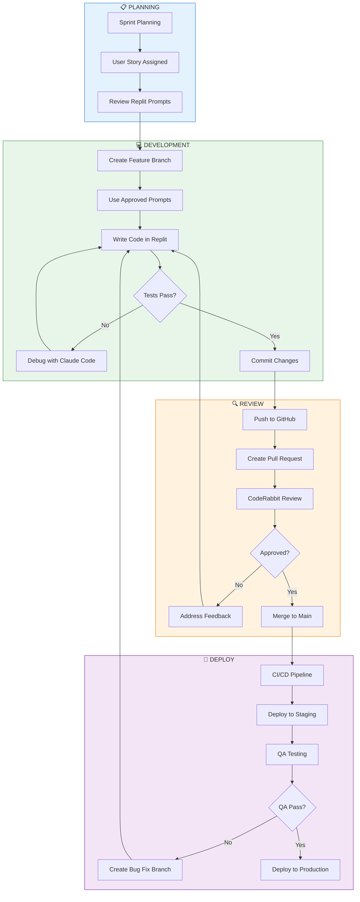
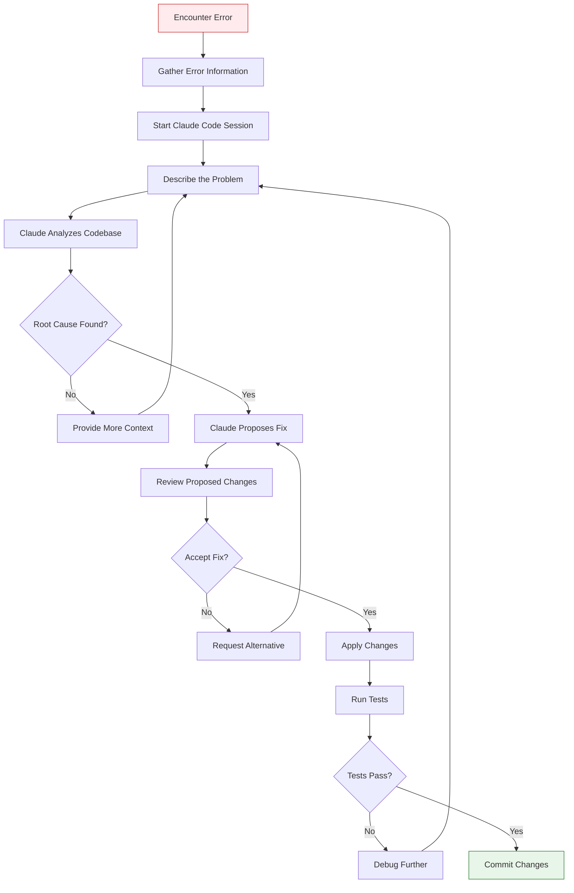

# Ninja Platform Developer Training Guide

**Version:** 2.0  
**Last Updated:** December 2025  
**Classification:** Internal Use Only  
**Duration:** 4 hours (self-paced)

---

## Table of Contents

1. Introduction
2. Module 1: Development Environment
3. Module 2: Development Workflow
4. Module 3: AI Agent Safety Protocols
5. Module 4: Claude Code for Debugging
6. Module 5: Secrets Management with Bitwarden
7. Module 6: Hands-On Exercises
8. Quick Reference
9. Resources

---

## Introduction

### Purpose

This training guide prepares developers to work effectively on the Ninja Platform. It covers the complete development workflow from environment setup through deployment, with special emphasis on AI-assisted development safety and debugging practices.

### Learning Objectives

After completing this training, you will be able to:

- Set up and configure your Replit development environment
- Follow the team's Git workflow and PR process
- Use AI tools safely and effectively
- Debug issues using Claude Code
- Manage secrets securely with Bitwarden
- Understand the CI/CD pipeline

### Prerequisites

- Completed the Git and GitHub Training Course
- Replit account added to S4Carlisle team
- GitHub account added to s4cindia organization
- Basic knowledge of JavaScript/TypeScript and React

---

## Module 1: Development Environment

### 1.1 Environment Overview

The Ninja Platform uses a cloud-first development approach:

| Component | Tool | Purpose |
|-----------|------|---------|
| IDE | Replit | Collaborative development |
| Version Control | GitHub | Source code management |
| Code Review | CodeRabbit | Automated PR review |
| CI/CD | GitHub Actions | Automated testing and deployment |
| Debugging | Claude Code | AI-assisted debugging |
| Secrets | Bitwarden | Credential management |

### 1.2 Replit Workspace

Your Replit workspace contains:

- **ninja-backend**: Node.js/Express API server
- **ninja-frontend**: React/Vite application

For detailed setup instructions, see the **Ninja Replit Setup Guide**.

### 1.3 Key Configuration Files

| File | Purpose |
|------|---------|
| `replit.nix` | System packages (Node.js, PostgreSQL, etc.) |
| `.replit` | Run commands and port configuration |
| `replit.md` | AI Agent context and constraints |
| `.env` / Secrets | Environment variables |

---

## Module 2: Development Workflow

### 2.1 Workflow Overview

The Ninja development workflow follows a structured process from task assignment to deployment.

#### Workflow Diagram (Mermaid)



### 2.2 Daily Workflow Steps

#### Step 1: Start of Day

```bash
# Sync with main branch
git checkout main
git pull origin main
```

#### Step 2: Create Feature Branch

```bash
# Use naming convention: type/NINJA-XXX-description
git checkout -b feat/NINJA-123-pdf-validation
```

#### Step 3: Development

1. Review the Sprint Replit Prompts for your user story
2. Use ONLY approved prompts for feature development
3. Write code following team standards
4. Run tests frequently

#### Step 4: Commit and Push

```bash
# Stage changes
git add .

# Commit with conventional format
git commit -m "feat(validation): add PDF/UA structure check

- Implement tagged PDF detection
- Add structure tree validation
- Update VPAT criteria mapping

Refs: NINJA-123"

# Push to remote
git push -u origin feat/NINJA-123-pdf-validation
```

#### Step 5: Create Pull Request

1. Go to GitHub repository
2. Click "Compare & pull request"
3. Fill in PR template
4. Wait for CodeRabbit review
5. Address feedback
6. Request human review

### 2.3 Branch Naming Convention

| Type | Pattern | Example |
|------|---------|---------|
| Feature | `feat/NINJA-XXX-description` | `feat/NINJA-123-pdf-validation` |
| Bug Fix | `fix/NINJA-XXX-description` | `fix/NINJA-456-auth-error` |
| Documentation | `docs/NINJA-XXX-description` | `docs/NINJA-789-api-docs` |
| Refactor | `refactor/NINJA-XXX-description` | `refactor/NINJA-101-cleanup` |

### 2.4 Commit Message Format

```
<type>(<scope>): <subject>

<body>

<footer>
```

**Types:** `feat`, `fix`, `docs`, `style`, `refactor`, `test`, `chore`

---

## Module 3: AI Agent Safety Protocols

### 3.1 The AI Risk Landscape

AI coding assistants are powerful but require careful management. There are documented cases of AI agents:

- Dropping production database tables
- Committing secrets to repositories
- Breaking authentication systems
- Installing malicious packages

### 3.2 Mandatory Prompt Usage Rule

**⚠️ CRITICAL RULE: Feature Development Prompts**

| Scenario | Rule | Source |
|----------|------|--------|
| **Feature Development** | **MANDATORY:** Use ONLY approved sprint prompts | Sprint-X-Replit-Prompts.md |
| **Debugging** | PERMITTED: Use Claude Code with approved workflow | This document |
| **Experimentation** | ONLY IN FORKS: Free prompting in isolated forks only | Team policy |

> **Why This Matters:** The approved sprint prompts have been carefully crafted to:
> - Maintain architectural consistency
> - Include guardrails against destructive actions
> - Prevent the "rogue AI" problem
> - Ensure code quality and patterns

### 3.3 Where to Find Approved Prompts

Approved prompts are located in the project documentation:

| Sprint | Document |
|--------|----------|
| Sprint 1 | `Sprint-1-Replit-Prompts.md` |
| Sprint 2 | `Sprint-2-Replit-Prompts.md` |
| Sprint 3 | `Sprint-3-Replit-Prompts.md` |
| Sprint 4 | `Sprint-4-Replit-Prompts.md` |
| Sprint 5 | `Sprint-5-Replit-Prompts.md` |
| Sprint 6 | `Sprint-6-Replit-Prompts.md` |
| Sprint 7 | `Sprint-7-Replit-Prompts.md` |

### 3.4 Agent Isolation Protocol

| Environment | AI Usage | Risk Level |
|-------------|----------|------------|
| Production Repl | ❌ NEVER | Critical |
| Shared Dev Repl | ⚠️ Only with approved prompts | High |
| Personal Fork | ✅ Permitted | Low |
| Local Machine | ✅ Full access | Minimal |

### 3.5 Forbidden AI Actions

The following actions are NEVER permitted via AI prompts:

- ❌ DROP TABLE or DROP DATABASE commands
- ❌ Schema modifications without approval
- ❌ Deleting files outside the project
- ❌ Installing packages not in approved list
- ❌ Modifying authentication/authorization code
- ❌ Accessing production credentials

---

## Module 4: Claude Code for Debugging

### 4.1 Introduction to Claude Code

Claude Code is Anthropic's command-line tool for agentic coding. It excels at debugging because it can:

- Read your entire codebase (200K token context)
- Trace issues across multiple files
- Run tests and iterate on fixes
- Explain complex error chains

For detailed capabilities comparison, see the **Claude Code Introduction Guide**.

### 4.2 Claude Code Debugging Workflow

Follow this workflow when debugging issues:



### 4.3 Step-by-Step Debugging with Claude Code

#### Step 1: Gather Error Information

Before starting Claude Code, collect:

| Information | How to Collect | Example |
|-------------|---------------|---------|
| Error message | Copy from console/logs | `TypeError: Cannot read property 'id' of undefined` |
| Stack trace | Copy full trace | Lines showing file:line numbers |
| Input that caused error | Note the request/data | `POST /api/jobs with { type: 'pdf' }` |
| Expected behavior | Describe what should happen | "Should create a job and return job ID" |
| Actual behavior | Describe what happened | "Returns 500 error" |
| Screenshots | Take screenshots if UI issue | Screenshot of error state |

#### Step 2: Start Claude Code Session

```bash
# Navigate to project directory
cd ninja-backend

# Start Claude Code
claude

# You'll see the Claude Code prompt:
# >
```

#### Step 3: Describe the Problem (Template)

Use this template for consistent debugging requests:

```
I'm encountering an error in the Ninja Platform backend.

## Error Information
- **Error Message:** [paste exact error message]
- **Stack Trace:**
```
[paste full stack trace]
```

## Context
- **File(s) Involved:** [e.g., src/modules/jobs/jobs.service.ts]
- **Function/Method:** [e.g., createJob()]
- **Trigger:** [e.g., POST request to /api/v1/jobs]

## Input Data
```json
[paste the input that caused the error]
```

## Expected Behavior
[describe what should happen]

## Actual Behavior
[describe what actually happens]

## What I've Already Tried
- [list any debugging steps you've taken]

Please analyze the codebase to identify the root cause and propose a fix.
```

#### Step 4: Review Claude's Analysis

Claude Code will:
1. Read relevant files in your codebase
2. Trace the execution path
3. Identify the root cause
4. Propose a fix

**Example Claude Code Session:**

```
> I'm encountering an error when creating a job...

Claude: I'll analyze the job creation flow. Let me read the relevant files...

Reading src/modules/jobs/jobs.controller.ts...
Reading src/modules/jobs/jobs.service.ts...
Reading src/modules/jobs/jobs.repository.ts...

I found the issue. In jobs.service.ts at line 45, you're accessing 
`req.user.id` but the user object is not being passed from the 
controller. The middleware attaches it to `req.user`, but the 
service is receiving `undefined`.

Proposed fix:

In jobs.controller.ts, line 23:
- const job = await this.jobsService.create(createJobDto);
+ const job = await this.jobsService.create(createJobDto, req.user);

And in jobs.service.ts, update the method signature:
- async create(dto: CreateJobDto) {
+ async create(dto: CreateJobDto, user: User) {

Would you like me to apply these changes?
```

#### Step 5: Apply and Verify

```
> Yes, apply those changes.

Claude: Changes applied. Let me run the tests to verify...

Running npm test...

✓ JobsService.create should create job with user context
✓ JobsController.create should pass user to service

All tests pass. The fix has been applied.
```

### 4.4 Providing Screenshots to Claude Code

For UI-related bugs, include screenshots:

#### Method 1: Describe the Screenshot

```
I'm seeing a visual bug. Here's what the screenshot shows:
- The submit button is positioned below the fold
- The error message appears in red at the top
- The form fields are not aligned properly
- There's a console error visible: "React state update on unmounted component"
```

#### Method 2: Share Screenshot via URL (if available)

```
Screenshot of the issue: [paste URL if you've uploaded to Teams/Slack]
```

#### Method 3: Export Component State

```
The component state when the error occurs:
```json
{
  "isLoading": false,
  "error": "Failed to fetch",
  "data": null
}
```
```

### 4.5 Debugging Prompt Templates

#### Template: API Endpoint Error

```
## API Endpoint Debugging

**Endpoint:** [METHOD] /api/v1/[path]
**Error Code:** [e.g., 500, 400, 401]

### Request
```json
{
  "headers": { ... },
  "body": { ... }
}
```

### Response
```json
{
  "error": "...",
  "message": "..."
}
```

### Logs
```
[paste relevant server logs]
```

Please trace the request through the codebase and identify where it fails.
```

#### Template: Database Query Error

```
## Database Query Debugging

**Operation:** [e.g., INSERT, UPDATE, SELECT]
**Table:** [e.g., jobs, users]
**Error:** [paste Prisma/SQL error]

### Query Context
- File: [e.g., src/modules/jobs/jobs.repository.ts]
- Method: [e.g., createJob()]

### Input Data
```typescript
{
  // the data being inserted/updated
}
```

Please analyze the schema and query to identify the issue.
```

#### Template: React Component Error

```
## React Component Debugging

**Component:** [e.g., JobsTable]
**File:** src/components/[path]

### Error
```
[paste React error from console]
```

### Component State
```json
{
  // current state when error occurs
}
```

### Props Received
```json
{
  // props passed to component
}
```

Please analyze the component and its dependencies to identify the issue.
```

### 4.6 Best Practices for Claude Code Debugging

| Practice | Description |
|----------|-------------|
| Be Specific | Provide exact error messages, not summaries |
| Include Context | Share file names, function names, line numbers |
| Show Your Work | Mention what you've already tried |
| One Issue at a Time | Focus on a single problem per session |
| Verify Before Commit | Always run tests after applying fixes |
| Document Solutions | Add comments explaining the fix for future reference |

---

## Module 5: Secrets Management with Bitwarden

### 5.1 Why Bitwarden?

The Ninja Platform uses Bitwarden for secure credential management:

| Feature | Benefit |
|---------|---------|
| Team sharing | Securely share credentials across the team |
| Collections | Organize secrets by environment/project |
| Secrets Manager | Programmatic access for CI/CD |
| Audit logging | Track who accessed what, when |
| Cost-effective | $4/user/month (Teams plan) |
| Open source | Transparent, auditable security |

### 5.2 Bitwarden Organization Structure

The S4Carlisle Bitwarden organization is structured as follows:

```
S4Carlisle Organization
├── 📁 Collection: AWS-Production
│   ├── AWS Console Credentials
│   ├── RDS Master Password
│   └── S3 Access Keys
├── 📁 Collection: AWS-Staging
│   ├── AWS Console Credentials
│   ├── RDS Master Password
│   └── S3 Access Keys
├── 📁 Collection: Ninja-Development
│   ├── Neon Database URL
│   ├── Gemini API Key
│   ├── Anthropic API Key
│   └── JWT Secret
├── 📁 Collection: Third-Party-Services
│   ├── GitHub Personal Access Token
│   ├── Replit API Token
│   └── CodeRabbit Configuration
└── 📁 Collection: Shared-Team
    ├── Microsoft 365 Service Account
    └── Teams Webhook URLs
```

### 5.3 Setting Up Bitwarden

#### Step 1: Accept Organization Invitation

1. Check your email for Bitwarden organization invitation
2. Click the invitation link
3. Create account or sign in with existing account
4. Accept the organization invitation

#### Step 2: Install Bitwarden

**Browser Extension (Recommended for daily use):**
1. Go to https://bitwarden.com/download/
2. Install extension for your browser
3. Log in with your account
4. Verify you can see S4Carlisle organization

**Desktop App (Optional):**
1. Download from https://bitwarden.com/download/
2. Install and log in
3. Enable biometric unlock for convenience

**CLI (For developers):**
```bash
# Install via npm
npm install -g @bitwarden/cli

# Login
bw login

# Unlock vault (required before each session)
bw unlock

# Set session key (paste the output from unlock)
export BW_SESSION="your-session-key"

# List items in a collection
bw list items --collectionid <collection-id>
```

#### Step 3: Access Your Collections

1. Open Bitwarden
2. Click on your organization (S4Carlisle)
3. Navigate to assigned collections
4. You'll only see collections you have access to

### 5.4 Retrieving Secrets for Development

#### For Replit Secrets:

1. Open Bitwarden browser extension
2. Navigate to `Ninja-Development` collection
3. Find the secret you need (e.g., "Gemini API Key")
4. Copy the value
5. In Replit, go to Tools → Secrets
6. Add the secret with matching key name

| Bitwarden Item | Replit Secret Key |
|----------------|-------------------|
| Gemini API Key | `GEMINI_API_KEY` |
| Neon Database URL | `DATABASE_URL` |
| JWT Secret | `JWT_SECRET` |
| Anthropic API Key | `ANTHROPIC_API_KEY` |

#### For Local Development:

1. Copy secrets from Bitwarden to `.env` file
2. **NEVER commit `.env` to Git**
3. Ensure `.env` is in `.gitignore`

### 5.5 Bitwarden Best Practices

| Practice | Description |
|----------|-------------|
| Never share outside Bitwarden | Don't paste secrets in Slack/Teams/Email |
| Use collections | Keep secrets organized by environment |
| Rotate regularly | Update keys quarterly or after team changes |
| Use secure notes | Store complex credentials with context |
| Enable 2FA | Protect your Bitwarden account with 2FA |
| Lock vault | Set auto-lock to 5 minutes |

### 5.6 Migrating Personal Secrets to Organization

If you have secrets in a personal Bitwarden vault that should be in the organization:

```bash
# 1. Export your personal vault
# Bitwarden Web → Tools → Export Vault → .json format

# 2. Edit the export file to include only relevant items

# 3. Request admin to import to appropriate collection
# Or use the Bitwarden web UI to move items:
# - Select item → Edit → Move to Organization
```

### 5.7 Bitwarden Secrets Manager (For CI/CD)

Bitwarden Secrets Manager provides programmatic access for automated pipelines:

```yaml
# Example GitHub Actions usage
- name: Get secrets from Bitwarden
  uses: bitwarden/sm-action@v1
  with:
    access_token: ${{ secrets.BW_ACCESS_TOKEN }}
    secrets: |
      GEMINI_API_KEY > GEMINI_API_KEY
      DATABASE_URL > DATABASE_URL
```

**Note:** Secrets Manager configuration is managed by the DevOps engineer. Developers should use the Bitwarden browser extension for daily work.

---

## Module 6: Hands-On Exercises

### Exercise 1: Environment Setup Verification

**Objective:** Verify your development environment is correctly configured.

**Steps:**

1. Open Replit and navigate to ninja-backend
2. Verify you can see the Secrets panel
3. Run `npm run dev` and verify server starts
4. Check Git configuration:
   ```bash
   git config user.name
   git config user.email
   git remote -v
   ```
5. Create a test branch:
   ```bash
   git checkout -b test/verify-setup-[yourname]
   ```
6. Delete the test branch:
   ```bash
   git checkout main
   git branch -d test/verify-setup-[yourname]
   ```

**Expected Result:** All commands succeed without errors.

---

### Exercise 2: Claude Code Debugging Session

**Objective:** Practice debugging with Claude Code using a simulated error.

**Scenario:** You're working on the job creation endpoint and encounter an error.

**Setup:**

1. Install Claude Code (if not already installed):
   ```bash
   npm install -g @anthropic-ai/claude-code
   ```

2. Set up your API key:
   ```bash
   export ANTHROPIC_API_KEY="your-key-from-bitwarden"
   ```

3. Navigate to the project:
   ```bash
   cd ninja-backend
   ```

4. Start Claude Code:
   ```bash
   claude
   ```

**Exercise Task:**

Use this debugging prompt to practice:

```
I'm practicing debugging with Claude Code. Please help me understand
a hypothetical error scenario.

## Simulated Error
```
TypeError: Cannot read properties of undefined (reading 'validate')
    at ValidationService.validateDocument (src/modules/validation/validation.service.ts:45:23)
    at JobsService.processJob (src/modules/jobs/jobs.service.ts:78:35)
    at processTicksAndRejections (node:internal/process/task_queues:95:5)
```

## Context
- The error occurs when processing a PDF validation job
- The job was created successfully but fails during processing
- The input document is a valid PDF file

## Questions for Claude
1. What are the likely causes of this error?
2. What files should I check?
3. How would you trace this issue through the codebase?
4. What debugging steps would you recommend?

Note: This is a training exercise. Please explain your debugging 
thought process step by step.
```

**What to Observe:**

- How Claude reads and analyzes files
- The logical flow of debugging
- The questions Claude asks for clarification
- The proposed solutions and their explanations

**Debrief Questions:**

1. What did Claude identify as the root cause?
2. How did Claude trace through the files?
3. What additional context would have helped?

---

### Exercise 3: Bitwarden Secret Retrieval

**Objective:** Practice retrieving secrets from Bitwarden and configuring Replit.

**Steps:**

1. Open Bitwarden browser extension
2. Navigate to S4Carlisle organization
3. Find the `Ninja-Development` collection
4. Locate the "Gemini API Key" entry
5. Copy the API key value
6. In Replit, go to Tools → Secrets
7. Verify `GEMINI_API_KEY` exists or add it
8. Test the key is accessible:
   ```javascript
   // In Replit console
   console.log('Key exists:', !!process.env.GEMINI_API_KEY);
   console.log('Key length:', process.env.GEMINI_API_KEY?.length);
   ```

**Expected Result:** Key exists: true, Key length shows a number.

---

### Exercise 4: Complete Debugging Workflow

**Objective:** Practice the full debugging workflow from error to fix.

**Scenario:** A team member reports that the health check endpoint is returning 500 errors intermittently.

**Steps:**

1. **Gather Information:**
   - Ask: "What error message appears in the logs?"
   - Ask: "When did this start happening?"
   - Ask: "Is it consistent or intermittent?"

2. **Start Claude Code Session:**
   ```bash
   cd ninja-backend
   claude
   ```

3. **Submit Debugging Request:**
   ```
   I need to debug an intermittent 500 error on the health check endpoint.

   ## Error Information
   - **Endpoint:** GET /api/v1/health
   - **Error:** Sometimes returns 500 instead of 200
   - **Pattern:** Happens more frequently under load

   ## Current Health Check Code Location
   - src/modules/health/health.controller.ts
   - src/modules/health/health.service.ts

   ## What I Know
   - The endpoint checks database connectivity
   - Error logs show: "Connection pool exhausted"

   Please analyze the health check implementation and identify:
   1. What's causing the intermittent failure
   2. Why it happens under load
   3. How to fix it
   ```

4. **Follow Claude's Analysis:**
   - Review the files Claude reads
   - Understand the explanation
   - Evaluate the proposed fix

5. **Document the Solution:**
   - Write a brief summary of the issue
   - Note the fix applied
   - Record any follow-up actions

---

## Quick Reference

### Git Commands

| Command | Purpose |
|---------|---------|
| `git checkout main` | Switch to main branch |
| `git pull origin main` | Get latest changes |
| `git checkout -b branch-name` | Create and switch to branch |
| `git add .` | Stage all changes |
| `git commit -m "message"` | Commit changes |
| `git push -u origin branch-name` | Push branch to remote |

### Claude Code Commands

| Command | Purpose |
|---------|---------|
| `claude` | Start interactive session |
| `claude init` | Initialize project context |
| `claude --help` | Show help |
| Ctrl+C | Exit session |

### Bitwarden CLI Commands

| Command | Purpose |
|---------|---------|
| `bw login` | Log in to Bitwarden |
| `bw unlock` | Unlock vault |
| `bw list items` | List all items |
| `bw get item "name"` | Get specific item |

### Important URLs

| Resource | URL |
|----------|-----|
| GitHub Organization | https://github.com/s4cindia |
| Replit Team | https://replit.com/t/s4carlisle-publishing-servic |
| Bitwarden | https://vault.bitwarden.com |
| Claude Console | https://console.anthropic.com |

---

## Resources

### Documentation

- **Ninja Replit Setup Guide** - Environment configuration
- **Replit Teams Guide v2** - Collaboration workflows
- **Claude Code Introduction Guide** - Advanced Claude Code usage
- **Sprint Replit Prompts** - Approved prompts by sprint
- **CI/CD Pipeline Setup Guide** - Deployment pipeline

### Support

| Issue Type | Contact |
|------------|---------|
| Access problems | Team Lead |
| Technical blockers | #ninja-development Teams channel |
| Bitwarden access | Admin (request via team lead) |
| Urgent issues | Tag team lead in Teams |

---

*Version: 2.0 | Last Updated: December 2025*  
*This document is part of the Ninja Platform Knowledge Base*
