# Ninja Platform Replit Setup Guide

## Quick Start for New Developers

**Version:** 2.3  
**Last Updated:** December 2025  
**Audience:** New developers joining the Ninja Platform team

---

## Overview

This guide walks you through setting up your Replit development environment for the Ninja Platform. 

**Two Scenarios:**

| Scenario | Who | Time Required |
|----------|-----|---------------|
| **First-Time Setup** | New developers joining the team | 30-45 minutes |
| **New Fork Setup** | Existing developers creating a new fork | 10-15 minutes |

Use the appropriate section based on your situation.

---

## Quick Reference: What's Inherited vs. What Needs Configuration

When you create a fork, some items are inherited from the main Repl and some need fresh configuration:

| Item | Inherited? | Action for New Fork? |
|------|------------|---------------------|
| Nix Packages (replit.nix) | ✅ Yes | None needed |
| AI Context (replit.md) | ✅ Yes | None needed |
| Code and Files | ✅ Yes | None needed |
| Git Remote Connection | ✅ Yes | None needed |
| PostgreSQL Database | ❌ No | Provision new database |
| Redis/Key-Value Store | ❌ No | Provision new store |
| Secrets (JWT, API keys) | ❌ No | Add from Bitwarden |

---

# PART A: First-Time Setup

**For new developers joining the team. Complete all steps below.**

---

## Step 1: Prerequisites

Before starting, ensure you have:

- [ ] Replit account (sign up at https://replit.com)
- [ ] Invitation to the S4Carlisle Replit Team (request from team lead)
- [ ] GitHub account with access to s4cindia organization
- [ ] Bitwarden account for secrets access

---

## Step 2: Accept Team Invitation

1. Check your email for the Replit Teams invitation
2. Click the invitation link
3. Sign in to Replit (or create an account)
4. Accept the team invitation
5. You should now see **s4carlisle-publishing-servic** in your team list

---

## Step 3: Understand the Project Structure

The Ninja Platform uses Replit Projects to organize development:

```mermaid
flowchart TB
    subgraph Team["🏢 s4carlisle-publishing-servic (Team)"]
        subgraph Backend["📁 ninja-backend (Project)"]
            MainBackend["🔒 ninja-backend<br/>(Main Repl)<br/><i>Protected, production code</i>"]
            Fork1["👤 developer-name-date<br/>(Fork)"]
            Fork2["👤 another-dev-date<br/>(Fork)"]
            MainBackend -.->|"+ New fork"| Fork1
            MainBackend -.->|"+ New fork"| Fork2
        end

        subgraph Frontend["📁 ninja-frontend (Project)"]
            MainFrontend["🔒 ninja-frontend<br/>(Main Repl)<br/><i>Protected, production code</i>"]
            Fork3["👤 developer-name-date<br/>(Fork)"]
            Fork4["👤 another-dev-date<br/>(Fork)"]
            MainFrontend -.->|"+ New fork"| Fork3
            MainFrontend -.->|"+ New fork"| Fork4
        end
    end

    style MainBackend fill:#fee2e2,stroke:#dc2626,stroke-width:2px
    style MainFrontend fill:#fee2e2,stroke:#dc2626,stroke-width:2px
    style Fork1 fill:#dcfce7,stroke:#16a34a
    style Fork2 fill:#dcfce7,stroke:#16a34a
    style Fork3 fill:#dcfce7,stroke:#16a34a
    style Fork4 fill:#dcfce7,stroke:#16a34a
```



**Key Concepts:**

| Term | Description |
|------|-------------|
| **Team** | The S4Carlisle organization workspace |
| **Project** | Container for a main Repl and its forks |
| **Main Repl** | The protected production codebase |
| **Fork** | Your personal working copy linked to the main Repl |

---

## Step 4: Create Your First Fork

**IMPORTANT:** You will work in a **fork** of the main Repl, not the main Repl directly.

### Step 4.1: Navigate to the Project

1. Go to the Replit Teams page
2. Click on **Projects** in the left sidebar
3. Click on **ninja-backend** project

### Step 4.2: Create a Fork

1. Click the **+ New fork** button (top right corner)
2. Name your fork using the convention: `[your-name]-[date]` (e.g., `avrvenkatesa2-12-03`)
3. Click **Create Fork**

> ⚠️ **CRITICAL:** Do NOT use "Remix" - this creates an independent clone without a link back to the main Repl. Always use **+ New fork** from within the Project view.

| Method | Result | Use For |
|--------|--------|---------|
| **+ New fork** (in Project) | Fork linked to main Repl | ✅ Developer work |
| **Remix** | Independent clone (no link) | ❌ Don't use |

### Step 4.3: Open Your Fork

1. Your new fork appears in the "All Forks" section
2. Click on your fork name to open it
3. You now have your own workspace linked to the main Repl

---

## Step 5: Configure Your Environment

### Step 5.1: Provision PostgreSQL Database

1. Click the **PostgreSQL** tool in the left sidebar (or Tools → PostgreSQL)
2. Click **Create a database**
3. Replit will provision a Neon PostgreSQL database
4. The `DATABASE_URL` secret is automatically added
5. Set **History Retention** to **6 hours** (sufficient for development, minimizes Neon billing)

### Step 5.2: Provision Redis/Key-Value Storage

1. Click the **Key-Value Storage** tool in the left sidebar
2. Click **Create a database**
3. Replit will provision a Redis-compatible store
4. The connection details are automatically added to secrets

### Step 5.3: Add Required Secrets

1. Click the **Secrets** tool (lock icon) in the left sidebar
2. Add the following secrets from Bitwarden:

| Secret Key | Source (Bitwarden) | Description |
|------------|-------------------|-------------|
| `JWT_SECRET` | Ninja-Development collection | JWT signing key |
| `GEMINI_API_KEY` | Third-Party-Services collection | Google Gemini API key |

**To get secrets from Bitwarden:**
1. Log in to Bitwarden vault
2. Navigate to the appropriate collection
3. Copy the secret value
4. Paste into Replit Secrets

### Step 5.4: Verify Inherited Configuration (No Action Needed)

The following are automatically inherited from the main Repl - just verify they exist:

- **replit.nix** - Contains all required Nix packages
- **replit.md** - Contains AI Agent context for the project
- **.replit** - Contains run configuration

---

## Step 6: Install Dependencies and Run

### Step 6.1: Install Dependencies

1. Open the **Shell** tab at the bottom of Replit
2. Run:

```bash
npm install
```

3. Wait for installation to complete

### Step 6.2: Generate Prisma Client (Backend Only)

For the backend Repl:

```bash
npx prisma generate
```

### Step 6.3: Run the Application

1. Click the **Run** button (green play button at top)
2. The application should start
3. Check the console for any errors

**Expected Output (Backend):**
```
Server running on port 3000
Database connected
Redis connected
```

**Expected Output (Frontend):**
```
VITE ready in XXX ms
Local: http://localhost:5173
```

---

## Step 7: Verify Git Connection

Git is already configured and connected to GitHub through the main Repl.

### Step 7.1: Verify Remote

1. Open the **Shell** tab
2. Run:

```bash
git remote -v
```

3. You should see the GitHub repository URL

### Step 7.2: Sync with Main Branch

```bash
git fetch origin
git checkout main
git pull origin main
```

### Step 7.3: Create a Feature Branch

```bash
git checkout -b feat/NINJA-XXX-description
```

Replace `NINJA-XXX` with your ticket number and add a brief description.

---

## Step 8: Final Verification Checklist

Run through this checklist to confirm everything is working:

- [ ] Fork created and accessible
- [ ] PostgreSQL database provisioned
- [ ] Redis/Key-Value storage provisioned
- [ ] All secrets configured (JWT_SECRET, GEMINI_API_KEY)
- [ ] Dependencies installed (`npm install` completed)
- [ ] Prisma client generated (backend only)
- [ ] Application runs without errors
- [ ] Git connected to GitHub (`git remote -v` shows origin)
- [ ] Can create feature branches

**Congratulations!** Your first-time setup is complete. Skip to the **Daily Workflow** section.

---

# PART B: New Fork Setup

**For existing developers creating a new fork. Only complete the steps below.**

---

## Quick Steps for New Fork

If you're already on the team and need to create a new fork, follow these condensed steps:

### B.1: Create the Fork

1. Go to **Projects** → **ninja-backend** (or ninja-frontend)
2. Click **+ New fork** (top right)
3. Name: `[your-name]-[date]` (e.g., `avrvenkatesa2-12-04`)
4. Click **Create Fork**
5. Open your new fork

### B.2: Provision Databases

**PostgreSQL:**
1. Tools → PostgreSQL → Create a database
2. Set History Retention to 6 hours

**Redis:**
1. Tools → Key-Value Storage → Create a database

### B.3: Add Secrets

1. Click Secrets (lock icon)
2. Add from Bitwarden:
   - `JWT_SECRET` (Ninja-Development collection)
   - `GEMINI_API_KEY` (Third-Party-Services collection)

### B.4: Install and Run

```bash
# Install dependencies
npm install

# Generate Prisma client (backend only)
npx prisma generate

# Sync with main
git fetch origin
git checkout main
git pull origin main
```

Click **Run** to start the application.

### B.5: Create Feature Branch

```bash
git checkout -b feat/NINJA-XXX-description
```

**Done!** Your new fork is ready for development.

---

## New Fork Checklist

- [ ] Fork created via **+ New fork** (not Remix)
- [ ] PostgreSQL provisioned
- [ ] Redis provisioned
- [ ] Secrets added (JWT_SECRET, GEMINI_API_KEY)
- [ ] `npm install` completed
- [ ] `npx prisma generate` completed (backend)
- [ ] Application runs
- [ ] Feature branch created

---

# Daily Workflow

Once setup is complete, your daily workflow will be:

1. **Start of day:** Pull latest changes
   ```bash
   git checkout main
   git pull origin main
   ```

2. **Create feature branch:**
   ```bash
   git checkout -b feat/NINJA-XXX-description
   ```

3. **Use approved sprint prompts** for development (see `docs/sprint-prompts/`)

4. **Commit and push:**
   ```bash
   git add .
   git commit -m "feat(scope): description"
   git push -u origin feat/NINJA-XXX-description
   ```

5. **Create PR on GitHub**

6. **After PR merged:** Request merge to main Repl from your fork

---

# Reference: replit.md Templates

The `replit.md` file provides context to the AI Agent. These are inherited from the main Repl.

**Backend (ninja-backend/replit.md):**

```markdown
# Ninja Platform Backend

## Project Overview
Ninja is an accessibility and compliance validation SaaS platform for educational publishers.

## Tech Stack
- Runtime: Node.js 20+
- Language: TypeScript 5.x (strict mode)
- Framework: Express 4.x
- Database: PostgreSQL (Prisma ORM)
- Queue: BullMQ with Redis
- Validation: Zod schemas

## Critical Rules
1. NEVER commit secrets to Git
2. NEVER run DROP TABLE or DROP DATABASE
3. NEVER modify schema without approval
4. Use ES Modules (import/export)
5. Use async/await for all async operations
6. Validate all inputs with Zod schemas

## Recovery Commands
If the Repl gets stuck:
- Restart: kill 1
- Clear cache: rm -rf node_modules/.cache
- Reinstall: rm -rf node_modules && npm install
```

**Frontend (ninja-frontend/replit.md):**

```markdown
# Ninja Platform Frontend

## Project Overview
React-based frontend for the Ninja accessibility and compliance platform.

## Tech Stack
- Framework: React 18+
- Build Tool: Vite 5.x
- Language: TypeScript 5.x (strict mode)
- Styling: Tailwind CSS
- Components: Radix UI primitives
- State: Zustand
- Data Fetching: TanStack Query

## Critical Rules
1. NEVER commit secrets to Git
2. All components must be accessible (WCAG 2.1 AA)
3. Use TypeScript strict mode
4. No inline styles - use Tailwind classes
5. Keep components small and focused

## Recovery Commands
If the Repl gets stuck:
- Restart: kill 1
- Clear cache: rm -rf node_modules/.cache
- Reinstall: rm -rf node_modules && npm install
```

---

# Troubleshooting

### Problem: Repl won't start

**Solution:**
```bash
kill 1
rm -rf node_modules/.cache
npm install
```

### Problem: Database connection failed

**Solution:**
1. Check that PostgreSQL is provisioned (Tools → PostgreSQL)
2. Verify `DATABASE_URL` secret exists
3. Run `npx prisma generate`

### Problem: "Permission denied" on git push

**Solution:**
1. Verify GitHub is connected (Account Settings → Connected Services)
2. Reconnect GitHub if needed

### Problem: Packages not installing

**Solution:**
1. Check `replit.nix` has all required packages
2. Refresh the Repl (browser refresh)
3. Run `npm install` again

### Problem: Redis connection failed

**Solution:**
1. Check that Key-Value Storage is provisioned
2. Verify Redis-related secrets are set

---

# Getting Help

| Issue | Contact |
|-------|---------|
| Access problems | Team Lead |
| Technical blockers | `#ninja-development` Teams channel |
| Bitwarden access | Request via Team Lead |
| Stuck > 30 minutes | Tag team lead in Teams |

---

# Next Steps

After completing this setup:

1. Read the **Replit Teams Guide v2** for collaboration best practices
2. Complete the **Ninja Developer Training Guide**
3. Review your assigned sprint's Replit Prompts in `docs/sprint-prompts/`
4. Join the `#ninja-development` Teams channel

---

*Document maintained by S4Carlisle India Development Team*
